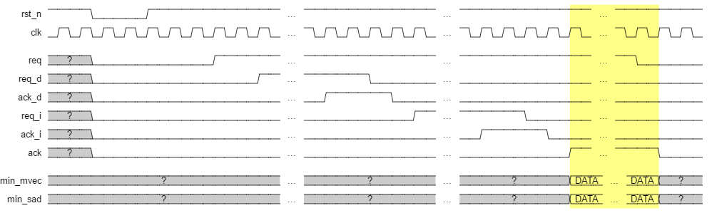
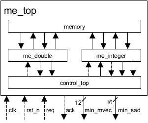

# Motion Estimation Processor

Hardware implementation of [Motion Estimation](https://en.wikipedia.org/wiki/Motion_estimation) algorithm written in Verilog-HDL.
It's currently under development.

## Description

- Fullsearch based motion estimation
- Double acuracy, integer acucuracy motion estimation
- No fractional motion estimation
- Template Block: 16x16 pixels
- Search Range  : ±24 pixels

## Required Tools

- [Icarus Verilog(>=10.0)](http://iverilog.wikia.com/wiki/Installation_Guide)
- [Altera Quartus Prime(>=16.0)](https://www.altera.co.jp/downloads/download-center.html)
- Excel 2013
- [Python 2.7](https://www.python.org/downloads/)

## How to run Simulation

1. Open `memory/memory.xlsx`
1. Click 'Create Memory' button to create `memory/memory_sw_A.txt`, `memory/memory_sw_B.txt`, `memory/memory_sw_C.txt`, `memory/memory_sw_D.txt` for search range memory and `memory_tb_A.txt`, `memory_tb_B.txt`, `memory_tb_C.txt`, `memory_tb_D.txt` for template block memory
1. Run `make_tb.sh`
1. You will find the wave file `testbench/***.vcd`

## How to synthesis Motion Estimation Processor

1. Open `memory/memory.xlsx`
1. Click 'Create Memory' button to create `memory/memory_sw_A.txt`, `memory/memory_sw_B.txt`, `memory/memory_sw_C.txt`, `memory/memory_sw_D.txt` for search range memory and `memory_tb_A.txt`, `memory_tb_B.txt`, `memory_tb_C.txt`, `memory_tb_D.txt` for template block memory
1. Run `make_mif.sh` to generate mif files
1. Open `fpga/fpga_top.qpf` in Altera Quartus Prime
1. Compile it

## Source Code Organization

The Motion Estimation Processor source code is organized as follows:

```text
docs/       documentation
fpga/       fpga related files
memory/     memory dependencies
rtl/        RTL files for Motion Estimation Processor
testbench/  test suites
tools/      tool for creating mif file
```

## Timing chart



## Block diagram



